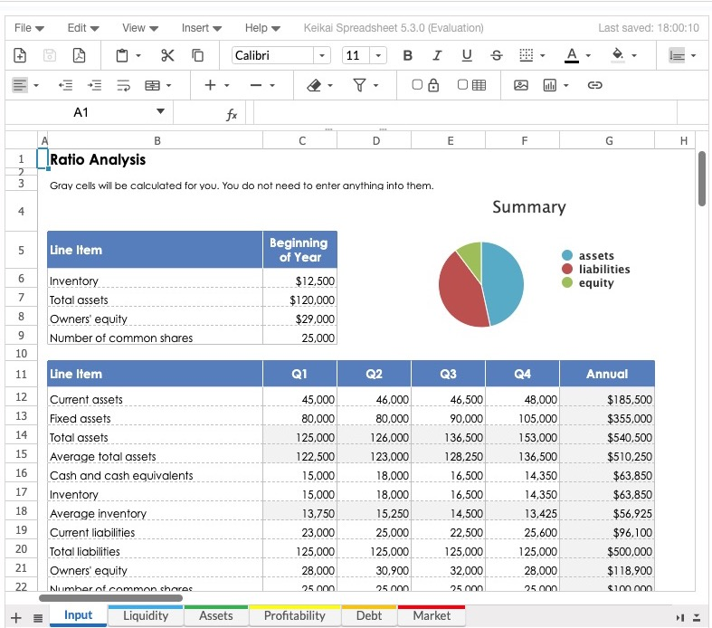

# Keikai Developer Reference Example Project
Keikai, effortlessly build spreadsheet-driven web apps.

This project contains the sample code of [Keikai Developer Reference](https://doc.keikai.io/dev-ref).

# How you can use Keikai
Please read various use cases in [blog](https://keikai.io/blog/).

# For Newcomers
If you are new to run Keikai, we recommend you to read [Tutorial](https://doc.keikai.io/tutorial) first to know some basic ideas.

# How to Run This Project
Clone the project and launch your command line interface in the folder with `pom.xml`. Execute the following commands based on your OS.

## Maven installed
### Tomcat (support JSP/JSF)
`mvn cargo:run` 

See [
Codehaus Cargo Maven 3 Plugin Getting Started](https://codehaus-cargo.github.io/cargo/Maven+3+Plugin+Getting+Started.html)

### Jetty
`mvn jetty:run`

It starts faster than Tomcat, but JSP/JSF doesn't work.

## No Maven installed yet
Run the Maven wrapper below which will download everything needed for you during starting up: 
* Linux / Mac

`./mvnw [SAME_GOAL_ABOVE]`

* Windows

`mvnw.cmd [SAME_GOAL_ABOVE]`

After the server starts up, visit http://localhost:8080/dev-ref with your browser. You will be seeing a list of examples, these examples are explained in Keikai [Developer Reference](https://doc.keikai.io/dev-ref).

After finishing trying it out, you can press `Ctrl+c` to stop the server.

# Try Freshly Release
Freshly release contains the latest features and bug fixes that are under development. It's built for testing and evaluation. Welcome to try it and [give us feedback](https://keikai.io/contact).

The steps are:
1. check the latest freshly version at [evaluation repo](https://mavensync.zkoss.org/eval/io/keikai/keikai-ex/)
2. change the keikai version in `pom.xml`
3. run the project according to [How to Run This Project](#How-to-Run-This-Project)

# Naming Convention
We create the folder and file names according to the section name of Developer Reference. So that you can easily identify a section and its corresponding example zul.  

# Related resources. Welcome to check them out:
## [Website](https://keikai.io)  
## [Demo](https://keikai.io/demo)
## [Document](https://doc.keikai.io)
## [Blog](https://keikai.io/blog)

